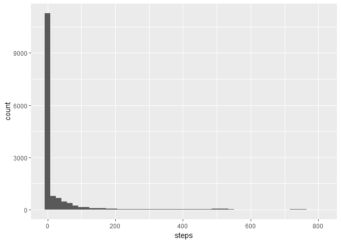
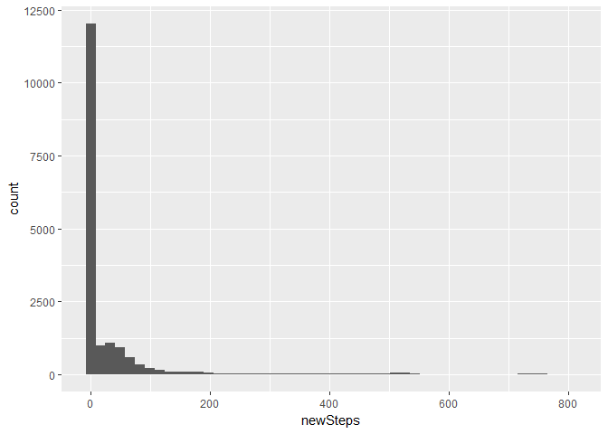
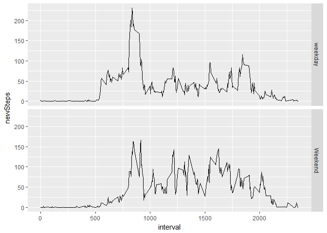

<<<<<<< HEAD
---
title: "Reproducible Research: Peer Assessment 1"
subtitle: "Peer Grated Assignment 1"
author: "Batman"
output: 
  html_document:
    keep_md: true
---


## Loading and preprocessing the data


```r
library(dplyr)
```

```
## 
## Attaching package: 'dplyr'
```

```
## The following objects are masked from 'package:stats':
## 
##     filter, lag
```

```
## The following objects are masked from 'package:base':
## 
##     intersect, setdiff, setequal, union
```

```r
library(lubridate)
```

```
## 
## Attaching package: 'lubridate'
```

```
## The following object is masked from 'package:base':
## 
##     date
```

```r
library(ggplot2)
data <- read.table(unz("C:/Users/hrist499/Documents/Coursera/DataScience/RepData_PeerAssessment1/activity.zip",
                       "activity.csv"),
                   header = TRUE,sep=",")
d<-tbl_df(data)
d$date<-ymd(d$date)
str(d)
```

```
## Classes 'tbl_df', 'tbl' and 'data.frame':	17568 obs. of  3 variables:
##  $ steps   : int  NA NA NA NA NA NA NA NA NA NA ...
##  $ date    : Date, format: "2012-10-01" "2012-10-01" ...
##  $ interval: int  0 5 10 15 20 25 30 35 40 45 ...
```

## What is mean total number of steps taken per day?

```r
ggplot(d, aes(steps))+geom_histogram(na.rm = TRUE,bins=50)
```

<!-- -->

Summary:

Mean  of number of steps per day is:

```r
mean(d$steps,na.rm=TRUE) 
```

```
## [1] 37.3826
```
Median number of steps per day is:


```r
median(d$steps,na.rm=TRUE) 
```

```
## [1] 0
```

## What is the average daily activity pattern?


```r
ggplot(d, aes(x=interval,y=steps)) +stat_summary(fun.y = "mean",geom = "line")
```

```
## Warning: Removed 2304 rows containing non-finite values (stat_summary).
```

<!-- -->

```r
summaryRes<- d %>%  group_by(interval) %>% summarize_all(mean,na.rm=TRUE)
intrv<-summaryRes[which.max(summaryRes$steps),"interval"]
stps<-summaryRes[which.max(summaryRes$steps),"steps"]
```

The interval with the maximum number of steps summarized over all days is ``835`` with ``206.1698113`` steps.

## Imputing missing values
 
 The number of missing values in the data can be seen in the data summary:

```r
summary(d)
```

```
##      steps             date               interval     
##  Min.   :  0.00   Min.   :2012-10-01   Min.   :   0.0  
##  1st Qu.:  0.00   1st Qu.:2012-10-16   1st Qu.: 588.8  
##  Median :  0.00   Median :2012-10-31   Median :1177.5  
##  Mean   : 37.38   Mean   :2012-10-31   Mean   :1177.5  
##  3rd Qu.: 12.00   3rd Qu.:2012-11-15   3rd Qu.:1766.2  
##  Max.   :806.00   Max.   :2012-11-30   Max.   :2355.0  
##  NA's   :2304
```
We are going to impute the missing values with the average value per interval that we have calculated in the previous section.
For this we are going to create a new variable called *newSteps*.


```r
newD<-d %>% group_by(interval) %>% mutate(newSteps=ifelse(is.na(steps),mean(steps,na.rm = TRUE),steps) )
newD
```

```
## # A tibble: 17,568 x 4
## # Groups: interval [288]
##    steps date       interval newSteps
##    <int> <date>        <int>    <dbl>
##  1    NA 2012-10-01        0   1.72  
##  2    NA 2012-10-01        5   0.340 
##  3    NA 2012-10-01       10   0.132 
##  4    NA 2012-10-01       15   0.151 
##  5    NA 2012-10-01       20   0.0755
##  6    NA 2012-10-01       25   2.09  
##  7    NA 2012-10-01       30   0.528 
##  8    NA 2012-10-01       35   0.868 
##  9    NA 2012-10-01       40   0     
## 10    NA 2012-10-01       45   1.47  
## # ... with 17,558 more rows
```

The histogram of the new steps variable is visible in the picture below:

```r
ggplot(newD, aes(newSteps))+geom_histogram(na.rm = TRUE,bins=50)
```

<!-- -->

Mean  of number of steps per day is:

```r
mean(newD$newSteps,na.rm=TRUE) 
```

```
## [1] 37.3826
```

Median number of steps per day is:


```r
median(newD$newSteps,na.rm=TRUE) 
```

```
## [1] 0
```
In our case we do not observe a change in the mean value because we substitute the missing values with the average per 5 minutes interval which will not change the mean value. Because the data set has more than 50% zeroes  we see that substituting 2303  missing values does not change the median value as well. however the distribution is different as you can see in the value of the 3rd quadrant from the summary of the *newSteps* column.

```r
summary(newD)
```

```
##      steps             date               interval         newSteps     
##  Min.   :  0.00   Min.   :2012-10-01   Min.   :   0.0   Min.   :  0.00  
##  1st Qu.:  0.00   1st Qu.:2012-10-16   1st Qu.: 588.8   1st Qu.:  0.00  
##  Median :  0.00   Median :2012-10-31   Median :1177.5   Median :  0.00  
##  Mean   : 37.38   Mean   :2012-10-31   Mean   :1177.5   Mean   : 37.38  
##  3rd Qu.: 12.00   3rd Qu.:2012-11-15   3rd Qu.:1766.2   3rd Qu.: 27.00  
##  Max.   :806.00   Max.   :2012-11-30   Max.   :2355.0   Max.   :806.00  
##  NA's   :2304
```
## Are there differences in activity patterns between weekdays and weekends?
Creating the weekend variable.


```r
newD %>% mutate(weekend= factor(ifelse(lubridate::wday(date) %in% c(1, 7),"Weekend","weekday"))) %>% 
  ggplot(., aes(x=interval,y=newSteps)) +stat_summary(fun.y = "mean",geom = "line")+facet_grid(weekend~.)
```

<!-- -->
=======
---
title: "Reproducible Research: Peer Assessment 1"
subtitle: "Peer Grated Assignment 1"
author: "Batman"
output: 
  html_document:
    keep_md: true
---


## Loading and preprocessing the data


```r
library(dplyr)
```

```
## 
## Attaching package: 'dplyr'
```

```
## The following objects are masked from 'package:stats':
## 
##     filter, lag
```

```
## The following objects are masked from 'package:base':
## 
##     intersect, setdiff, setequal, union
```

```r
library(lubridate)
```

```
## 
## Attaching package: 'lubridate'
```

```
## The following object is masked from 'package:base':
## 
##     date
```

```r
library(ggplot2)
data <- read.table(unz("C:/Users/hrist499/Documents/Coursera/DataScience/RepData_PeerAssessment1/activity.zip",
                       "activity.csv"),
                   header = TRUE,sep=",")
d<-tbl_df(data)
d$date<-ymd(d$date)
str(d)
```

```
## Classes 'tbl_df', 'tbl' and 'data.frame':	17568 obs. of  3 variables:
##  $ steps   : int  NA NA NA NA NA NA NA NA NA NA ...
##  $ date    : Date, format: "2012-10-01" "2012-10-01" ...
##  $ interval: int  0 5 10 15 20 25 30 35 40 45 ...
```

## What is mean total number of steps taken per day?

```r
ggplot(d, aes(steps))+geom_histogram(na.rm = TRUE,bins=50)
```

<!-- -->

Summary:

Mean  of number of steps per day is:

```r
mean(d$steps,na.rm=TRUE) 
```

```
## [1] 37.3826
```
Median number of steps per day is:


```r
median(d$steps,na.rm=TRUE) 
```

```
## [1] 0
```

## What is the average daily activity pattern?


```r
ggplot(d, aes(x=interval,y=steps)) +stat_summary(fun.y = "mean",geom = "line")
```

```
## Warning: Removed 2304 rows containing non-finite values (stat_summary).
```

<!-- -->

```r
summaryRes<- d %>%  group_by(interval) %>% summarize_all(mean,na.rm=TRUE)
intrv<-summaryRes[which.max(summaryRes$steps),"interval"]
stps<-summaryRes[which.max(summaryRes$steps),"steps"]
```

The interval with the maximum number of steps summarized over all days is ``835`` with ``206.1698113`` steps.

## Imputing missing values
 
 The number of missing values in the data can be seen in the data summary:

```r
summary(d)
```

```
##      steps             date               interval     
##  Min.   :  0.00   Min.   :2012-10-01   Min.   :   0.0  
##  1st Qu.:  0.00   1st Qu.:2012-10-16   1st Qu.: 588.8  
##  Median :  0.00   Median :2012-10-31   Median :1177.5  
##  Mean   : 37.38   Mean   :2012-10-31   Mean   :1177.5  
##  3rd Qu.: 12.00   3rd Qu.:2012-11-15   3rd Qu.:1766.2  
##  Max.   :806.00   Max.   :2012-11-30   Max.   :2355.0  
##  NA's   :2304
```
We are going to impute the missing values with the average value per interval that we have calculated in the previous section.
For this we are going to create a new variable called *newSteps*.


```r
newD<-d %>% group_by(interval) %>% mutate(newSteps=ifelse(is.na(steps),mean(steps,na.rm = TRUE),steps) )
newD
```

```
## # A tibble: 17,568 x 4
## # Groups: interval [288]
##    steps date       interval newSteps
##    <int> <date>        <int>    <dbl>
##  1    NA 2012-10-01        0   1.72  
##  2    NA 2012-10-01        5   0.340 
##  3    NA 2012-10-01       10   0.132 
##  4    NA 2012-10-01       15   0.151 
##  5    NA 2012-10-01       20   0.0755
##  6    NA 2012-10-01       25   2.09  
##  7    NA 2012-10-01       30   0.528 
##  8    NA 2012-10-01       35   0.868 
##  9    NA 2012-10-01       40   0     
## 10    NA 2012-10-01       45   1.47  
## # ... with 17,558 more rows
```

The histogram of the new steps variable is visible in the picture below:

```r
ggplot(newD, aes(newSteps))+geom_histogram(na.rm = TRUE,bins=50)
```

<!-- -->

Mean  of number of steps per day is:

```r
mean(newD$newSteps,na.rm=TRUE) 
```

```
## [1] 37.3826
```

Median number of steps per day is:


```r
median(newD$newSteps,na.rm=TRUE) 
```

```
## [1] 0
```
In our case we do not observe a change in the mean value because we substitute the missing values with the average per 5 minutes interval which will not change the mean value. Because the data set has more than 50% zeroes  we see that substituting 2303  missing values does not change the median value as well. however the distribution is different as you can see in the value of the 3rd quadrant from the summary of the *newSteps* column.

```r
summary(newD)
```

```
##      steps             date               interval         newSteps     
##  Min.   :  0.00   Min.   :2012-10-01   Min.   :   0.0   Min.   :  0.00  
##  1st Qu.:  0.00   1st Qu.:2012-10-16   1st Qu.: 588.8   1st Qu.:  0.00  
##  Median :  0.00   Median :2012-10-31   Median :1177.5   Median :  0.00  
##  Mean   : 37.38   Mean   :2012-10-31   Mean   :1177.5   Mean   : 37.38  
##  3rd Qu.: 12.00   3rd Qu.:2012-11-15   3rd Qu.:1766.2   3rd Qu.: 27.00  
##  Max.   :806.00   Max.   :2012-11-30   Max.   :2355.0   Max.   :806.00  
##  NA's   :2304
```
## Are there differences in activity patterns between weekdays and weekends?
Creating the weekend variable.


```r
newD %>% mutate(weekend= factor(ifelse(lubridate::wday(date) %in% c(1, 7),"Weekend","weekday"))) %>% 
  ggplot(., aes(x=interval,y=newSteps)) +stat_summary(fun.y = "mean",geom = "line")+facet_grid(weekend~.)
```

<!-- -->
>>>>>>> f9b1436421d51e7af2891536abd40551ef52d607
